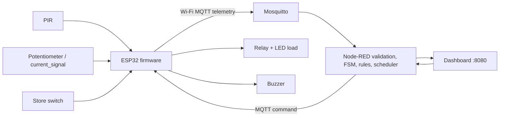

# IoT 55 - Giám sát điện năng và tự tắt thiết bị

Project mô phỏng và triển khai hệ thống IoT 4 lớp cho cửa hàng: đọc tín hiệu hiện diện, tín hiệu dòng điện mô phỏng, trạng thái cửa hàng; điều khiển relay; gửi dữ liệu qua Wi-Fi/MQTT; xử lý rule bằng Node-RED; và hiển thị dashboard điều khiển từ xa.

## Kiến trúc



## Trạng thái hiện thực

- Wokwi: mạch và logic local đã có trong `simulation/wokwi`.
- Firmware: PlatformIO build được cho ESP32; có Wi-Fi, MQTT, LWT, reconnect, telemetry và validate command.
- Middleware: flow Node-RED có validation, state machine, rule auto-shutdown, abnormal current, scheduler và HTTP API.
- Dashboard: giao diện nhẹ, đọc `/api/state` và gửi command tới `/api/command`.
- Docker: có Compose cho Mosquitto, Node-RED và Nginx dashboard.
- E2E thật với thiết bị/Wokwi kết nối broker local: **NOT VERIFIED** trong môi trường hiện tại vì máy chưa có Docker và Wokwi online không được xác nhận kết nối tới broker local.

## Topic MQTT

Namespace là `iot55/device01/`.

| Topic | Chiều | Mục đích |
|---|---|---|
| `telemetry` | ESP32 -> Node-RED | Tín hiệu tổng hợp, dùng `current_signal`, không giả mạo Ampere |
| `current` | ESP32 -> Node-RED | Tín hiệu ADC và threshold |
| `presence` | ESP32 -> Node-RED | `PRESENT` hoặc `NONE` |
| `status` | Hai chiều/retained | Online, store, mode, state |
| `event` | ESP32/Node-RED -> dashboard | Sự kiện và lỗi |
| `relay/state` | ESP32 -> Node-RED | Phản hồi relay |
| `cmd/relay` | Node-RED -> ESP32 | `ON` hoặc `OFF` |
| `cmd/mode` | Node-RED -> ESP32 | `AUTO` hoặc `MANUAL` |
| `cmd/override` | Node-RED -> ESP32 | `ACTIVE` hoặc `CLEAR` |
| `cmd/threshold` | Node-RED -> ESP32 | `threshold_signal` ADC |

`current_signal` là giá trị ADC mô phỏng. Chưa có calibration nên không gọi là Ampere và không dùng `current_a`.

## Chạy local bằng Docker

1. Cài Docker Desktop và mở Docker Engine.
2. Tạo `.env` từ `.env.example`, không ghi credential thật vào Git.
3. Chạy:

```powershell
docker compose up -d
```

4. Mở dashboard tại `http://localhost:8080` và Node-RED tại `http://localhost:1880`.
5. Mosquitto lắng nghe MQTT ở `localhost:1883`, WebSocket ở `localhost:9001`.

Nếu chưa dùng Docker, có thể import `middleware/node-red/flows.json` vào Node-RED cài native và chạy Mosquitto native.

## Build firmware

```powershell
cd firmware/esp32
Copy-Item include/config.example.h include/config.h
# Điền Wi-Fi và MQTT trong include/config.h trên máy triển khai.
pio run
pio run -t upload
pio device monitor
```

Firmware mặc định relay OFF khi khởi động. Telemetry phát mỗi 2 giây, MQTT tự subscribe command và reconnect khi mất mạng.

## Wokwi

Mở `simulation/wokwi/diagram.json` và `sketch.ino` trong Wokwi. GPIO giữ nguyên:

| Tín hiệu | GPIO |
|---|---:|
| PIR | 27 |
| Current signal | 34 |
| Store state | 26 |
| Relay | 25 |
| Buzzer | 33 |

Wokwi hiện kiểm thử local logic và Serial Monitor. Kết nối Wokwi tới MQTT local là **NOT VERIFIED**.

## Rule và state machine

- `CLOSED + NO PRESENCE + RELAY ON + AUTO` sau delay cấu hình -> `AUTO_SHUTDOWN`, publish `OFF`.
- `CLOSED + PRESENCE` -> `OCCUPIED`, không tự tắt.
- `current_signal > threshold_signal` -> `ABNORMAL_CURRENT` và event cảnh báo.
- `OVERRIDE` -> `MANUAL_OVERRIDE`, automation bị treo cho tới khi clear.
- Mất heartbeat -> dashboard cần hiển thị `OFFLINE`.

Các state chính: `NORMAL`, `AFTER_HOURS`, `OCCUPIED`, `AUTO_SHUTDOWN`, `ABNORMAL_CURRENT`, `MANUAL_OVERRIDE`, `FAULT`, `OFFLINE`.

## Kiểm thử

Danh sách T01-T12 nằm tại [tests/test-plan.md](tests/test-plan.md). Tất cả test tích hợp vẫn ghi `NOT VERIFIED` cho tới khi chạy đủ broker, Node-RED và device/simulator.

Kiểm tra tĩnh đã thực hiện:

- JSON Wokwi và Node-RED parse thành công.
- Firmware ESP32 PlatformIO build thành công.
- Docker Compose có đủ ba service chính, nhưng chưa chạy vì Docker chưa cài trong môi trường hiện tại.

## Giới hạn và an toàn

Mạch chỉ mô phỏng tải DC điện áp thấp. Không dùng sơ đồ này để đấu trực tiếp AC 220V. Cần calibration phần cứng trước khi chuyển `current_signal` sang đơn vị Ampere.

## Tài liệu

- [Kiến trúc](docs/architecture/04-architecture.md)
- [MQTT](docs/mqtt/05-mqtt-design.md)
- [Automation rules](docs/architecture/07-automation-rules.md)
- [State machine](docs/state-machine/06-state-machine.md)
- [Test plan](tests/test-plan.md)
