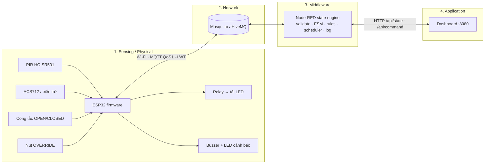
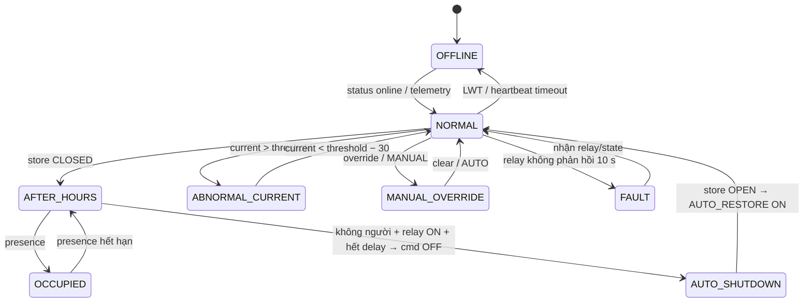

# IoT 55 · Giám sát điện năng & tự tắt thiết bị sau giờ đóng cửa

**IoT Energy Monitoring & Smart Power Automation System** — hệ thống IoT 4 lớp đầu-cuối:
cảm biến → ESP32 → Wi-Fi/MQTT → Mosquitto → Node-RED (rule engine + state machine + scheduler) → Dashboard → MQTT downlink → ESP32 → relay.

| Thành phần | Trạng thái kiểm chứng |
|---|---|
| Firmware ESP32 (PlatformIO, bản thật + bản Wokwi) | Build thành công, 0 warning |
| Node-RED state engine | 19 unit/consistency test pass (`npm test`) |
| Broker + Node-RED + API + dashboard (Docker) | 11/11 kịch bản E2E pass — [tests/evidence/e2e-latest.md](tests/evidence/e2e-latest.md) |
| Mô phỏng Wokwi chạy firmware thật, nối broker public | Cần chạy và chụp màn hình trong Wokwi (xem [simulation/wokwi/README.md](simulation/wokwi/README.md)) |
| Phần cứng thật (Phase 11, tuỳ chọn) | Không triển khai — dự án nghiệm thu hoàn toàn bằng mô phỏng |

---

## 1. Tổng quan
Cửa hàng nhỏ thường quên tắt đèn/quạt/thiết bị sau giờ đóng cửa. Hệ thống đo dòng tải, phát hiện người, biết cửa hàng đang mở hay đóng,
tự tắt tải khi **đóng cửa + không có người + tải đang bật**, cảnh báo dòng bất thường và cho phép giám sát/điều khiển từ xa.

## 2. Bài toán
- Phát hiện tải còn bật sau giờ đóng cửa và tự ngắt, nhưng **không ngắt khi vẫn còn người**.
- Phát hiện dòng điện vượt ngưỡng (quá tải/chập) và cảnh báo, có thể tự ngắt (cấu hình).
- Người quản lý theo dõi và điều khiển từ xa, có chế độ override thủ công, mọi hành động được ghi log.

## 3. Mục tiêu
1. Kiến trúc IoT 4 lớp đầy đủ, có cả **uplink** và **downlink**.
2. Mô phỏng là đường nghiệm thu chính (Wokwi); phần cứng là tuỳ chọn.
3. Demo tất định, tái lập được, có bằng chứng test.

## 4. Tính năng
- Telemetry 2 s/lần + gửi ngay khi có thay đổi (presence/store/relay/alarm).
- Rule 1 tự tắt sau giờ (debounce `AUTO_SHUTDOWN_DELAY_SECONDS`), tự bật lại khi mở cửa (`AUTO_RESTORE`).
- Rule 2 bảo vệ khi có người (huỷ đếm ngược, `SHUTDOWN_CANCELLED`).
- Rule 3 dòng bất thường có hysteresis, buzzer + LED đỏ, **Acknowledge** từ dashboard, `SAFETY_MODE=CUTOFF` để tự ngắt.
- Rule 4 điều khiển từ xa: relay ON/OFF, AUTO/MANUAL, override, đặt ngưỡng.
- Rule 5 override: nút vật lý trên mạch hoặc từ dashboard; firmware **từ chối** mọi lệnh `AUTO_*` khi override/MANUAL.
- Phát hiện OFFLINE bằng **LWT** và **heartbeat timeout**; FAULT khi relay không phản hồi lệnh.
- Fallback tại biên: mất MQTT > 30 s thì ESP32 tự áp dụng rule 1 cục bộ.
- Event log có cấu trúc (100 sự kiện gần nhất, lưu bền qua restart Node-RED).

## 5. Kiến trúc



Chi tiết: [docs/architecture/04-architecture.md](docs/architecture/04-architecture.md).

## 6. Ánh xạ 4 lớp IoT

| Lớp | Thành phần | File |
|---|---|---|
| 1 Sensing/Physical | PIR, cảm biến dòng (biến trở mô phỏng ACS712), công tắc giờ mở cửa, nút override, relay, LED tải, buzzer, LED trạng thái | [diagram.json](simulation/wokwi/diagram.json), [main.cpp](firmware/esp32/src/main.cpp) |
| 2 Network | Wi-Fi, MQTT 3.1.1, QoS 1, retained, LWT, reconnect không chặn | [main.cpp](firmware/esp32/src/main.cpp), [mosquitto.conf](middleware/mosquitto/mosquitto.conf) |
| 3 Middleware | Node-RED: parse, validate, FSM, rule engine, scheduler, heartbeat, event log, sinh lệnh | [state-engine.js](middleware/node-red/src/state-engine.js), [flows.json](middleware/node-red/flows.json) |
| 4 Application | Dashboard web + HTTP API, điều khiển từ xa | [dashboard/index.html](dashboard/index.html) |

## 7. Phần cứng

| Linh kiện | GPIO | Ghi chú |
|---|---:|---|
| PIR HC-SR501 | 27 | HIGH = có chuyển động; firmware giữ trạng thái 10 s (demo) |
| ACS712 (mô phỏng bằng biến trở) | 34 | ADC 0..4095; quy đổi tuyến tính 4095 = 20 A cho mô phỏng |
| Công tắc trượt OPEN/CLOSED | 26 | HIGH = CLOSED (mô phỏng giờ đóng cửa) |
| Nút OVERRIDE | 14 | INPUT_PULLUP, nhấn = đảo override |
| Relay module | 25 | HIGH = tải ON; khởi động luôn OFF (fail-safe) |
| Buzzer | 33 | Kêu ngắt quãng khi dòng bất thường chưa ACK |
| LED xanh (MQTT) | 4 | Sáng = MQTT OK, nháy chậm = chỉ có Wi-Fi, nháy nhanh = mất Wi-Fi |
| LED đỏ (ALARM) | 19 | Nháy = cảnh báo chưa ACK, sáng = đã ACK |

BOM và thông số: [docs/bom/03-hardware-spec.md](docs/bom/03-hardware-spec.md). **Thay thế có ghi nhận:** Wokwi không có ACS712 nên dùng biến trở tạo tín hiệu analog; giờ mở/đóng cửa lấy từ công tắc (tất định cho demo) hoặc scheduler (`STORE_STATUS_SOURCE=SCHEDULE`).

## 8. Phần mềm
ESP32 Arduino (PlatformIO) · PubSubClient 2.8 · ArduinoJson 7 · Eclipse Mosquitto 2.0.18 · Node-RED 4.0.9 · nginx 1.27 · Node.js ≥ 18 (test, thiết bị ảo) · Docker Compose · Wokwi.

## 9. MQTT topics
Namespace `iot55/device01/`. Đặc tả đầy đủ payload: [docs/mqtt/mqtt-topics.md](docs/mqtt/mqtt-topics.md).

| Topic | Chiều | Retained | Nội dung |
|---|---|---|---|
| `telemetry` | ESP32 → | không | dòng, ngưỡng, presence, store, relay, mode, override, alarm |
| `current`, `presence` | ESP32 → | có | giá trị gần nhất |
| `status` | ESP32 → | có | online/fw/ip; **LWT** `{"online":false}` |
| `relay/state` | ESP32 → | có | trạng thái relay + `changed_by` (phản hồi lệnh) |
| `event` | ESP32/Node-RED → | không | event log có cấu trúc (`origin`) |
| `system/state` | Node-RED → | có | trạng thái FSM tổng hợp |
| `cmd/relay` | → ESP32 | không | `{"command":"ON|OFF","source":"..."}` |
| `cmd/mode` | → ESP32 | **có** | `{"mode":"AUTO|MANUAL"}` |
| `cmd/override` | → ESP32 | không | `{"override":"ACTIVE|CLEAR"}` |
| `cmd/threshold` | → ESP32 | **có** | `{"threshold_signal":1..4095}` |
| `cmd/alarm` | → ESP32 | không | `{"action":"ACK"}` |

## 10. State machine
Node-RED là nơi quyết định (authoritative). Trạng thái được suy ra theo **thứ tự ưu tiên** sau mỗi input, mọi chuyển trạng thái đều được log `STATE_CHANGED`.



Bảng state / trigger / condition / action / next state: [docs/state-machine/06-state-machine.md](docs/state-machine/06-state-machine.md).

## 11. Luật tự động hoá

| Rule | Điều kiện | Hành động |
|---|---|---|
| 1 After hours | CLOSED ∧ không người ∧ relay ON ∧ AUTO ∧ ¬override, kéo dài ≥ delay | `cmd/relay OFF (AUTO_RULE1)`, event `AUTO_SHUTDOWN`; khi mở cửa → `AUTO_RESTORE` |
| 2 Presence | CLOSED ∧ có người | Không tắt; huỷ đếm ngược (`SHUTDOWN_CANCELLED`), state `OCCUPIED` |
| 3 Abnormal | current > threshold | Event `ABNORMAL_CURRENT` (WARNING), buzzer/LED; `SAFETY_MODE=CUTOFF` → `SAFETY_CUTOFF` |
| 4 Remote | Lệnh từ dashboard | Validate → MQTT downlink → event `REMOTE_COMMAND` → xác nhận qua `relay/state` |
| 5 Override | override ∨ MANUAL | Bỏ qua rule 1; firmware từ chối lệnh `AUTO_*` (`COMMAND_REJECTED`) |

## 12. Cài đặt
Yêu cầu: Docker Desktop, Node.js ≥ 18, (tuỳ chọn) PlatformIO, VS Code + Wokwi.

```powershell
Copy-Item .env.example .env      # không commit .env
docker compose up -d             # Mosquitto :1883, Node-RED :1880, Dashboard :8080
npm install                      # chỉ cần cho test E2E / thiết bị ảo
npm test                         # unit + consistency tests
npm run e2e                      # 11 kịch bản đầu-cuối, ghi bằng chứng vào tests/evidence/
```

## 13. Mô phỏng Wokwi
Wokwi chạy **đúng firmware** của thiết bị thật (`sketch.ino` được đồng bộ từ `firmware/esp32/src/main.cpp`), kết nối `Wokwi-GUEST` → `broker.hivemq.com`.
Để Node-RED nhận dữ liệu từ Wokwi: đặt `NODERED_MQTT_HOST=broker.hivemq.com` trong `.env` rồi `docker compose up -d`.
Hướng dẫn chi tiết, sơ đồ dây và checklist: [simulation/wokwi/README.md](simulation/wokwi/README.md).

## 14. Node-RED
Logic nằm ở [middleware/node-red/src/](middleware/node-red/src/); `npm run build` sinh `flows.json`. Không sửa trực tiếp `flows.json`.
Chi tiết: [middleware/node-red/README.md](middleware/node-red/README.md).

## 15. Dashboard
`http://localhost:8080` — hiển thị dòng (A + ADC), ngưỡng, presence, store (nguồn switch/lịch), relay, mode/override, state FSM + đếm ngược, sự kiện mới nhất, trạng thái kết nối API và thiết bị, biểu đồ, event log; điều khiển relay, AUTO/MANUAL, override, ACK, ngưỡng.
Chi tiết: [dashboard/README.md](dashboard/README.md).

## 16. Kiểm thử
- `npm test`: 12 test của state engine (TEST-01…12) + 7 test nhất quán (flows được build từ source, sketch trùng firmware, GPIO khớp sơ đồ, topic downlink được firmware xử lý, không commit secrets).
- `npm run e2e`: 11 kịch bản trên stack Docker thật với thiết bị ảo (cùng giao thức như firmware).
- Firmware: `pio run` trong `firmware/esp32` và `simulation/wokwi`.

Kế hoạch và kết quả: [tests/test-plan.md](tests/test-plan.md).

## 17. Kịch bản demo
Kịch bản tất định 6 bước (bình thường → tự tắt → có người → quá dòng → điều khiển từ xa → mất kết nối): [docs/demo/demo-script.md](docs/demo/demo-script.md).

## 18. Ảnh chụp màn hình
Lưu trong [screenshots/](screenshots/) theo checklist ở [tests/test-plan.md](tests/test-plan.md#bằng-chứng-cần-chụp). Chỉ dùng ảnh chụp thật.

## 19. Video
Xem [videos/README.md](videos/README.md).

## 20. Giới hạn
- Giá trị Ampe là quy đổi tuyến tính từ ADC mô phỏng; ACS712 thật cần hiệu chuẩn offset/độ nhạy.
- Broker public (HiveMQ) không xác thực, không mã hoá — chỉ dùng cho mô phỏng.
- Một thiết bị (`device01`); event log giữ 100 bản ghi trong context Node-RED (chưa có database).
- Override qua MQTT không retained: ESP32 khởi động lại thì override bị xoá (an toàn: automation tiếp tục).

## 21. Hướng phát triển
Nhiều thiết bị (`iot55/<id>/…`), lưu InfluxDB/Grafana, cảnh báo Telegram, TLS 8883 + ACL, OTA firmware, hiệu chuẩn ACS712 và tính kWh, RTC DS3231 để chạy lịch offline.

## An toàn
Chỉ dùng tải DC điện áp thấp (LED, quạt 5 V, đèn 12 V). **Không** đấu trực tiếp điện lưới 220 V/110 V nếu không có người có chuyên môn giám sát.

## Bảo mật
Không commit `.env`, `config.h`, `flows_cred.json`, `.config.*.json`. Hướng dẫn: [docs/security.md](docs/security.md).
