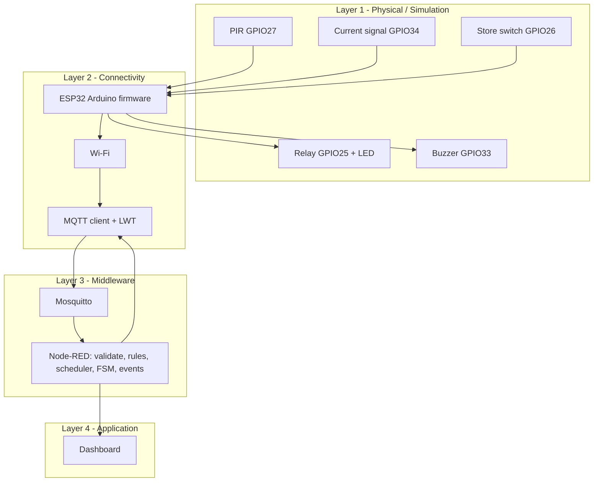

# Kiến trúc 4 lớp triển khai

> **Ghi chú (bản triển khai v2):** đây là tài liệu thiết kế Week 1. Hành vi thực tế của code được mô tả ở [README](../../README.md), [MQTT topics](../mqtt/mqtt-topics.md) và [state machine](../state-machine/06-state-machine.md). Khác biệt chính: dòng điện xử lý theo ADC `current_signal` (kèm `current_a` quy đổi), toàn bộ rule nằm trong một function node `state-engine` có unit test, delay demo 10 s.

Uplink dùng telemetry JSON. Downlink dùng command JSON. Tín hiệu dòng điện trong mô phỏng được giữ ở dạng `current_signal`/ADC; chưa có calibration để quy đổi thành Ampere.
